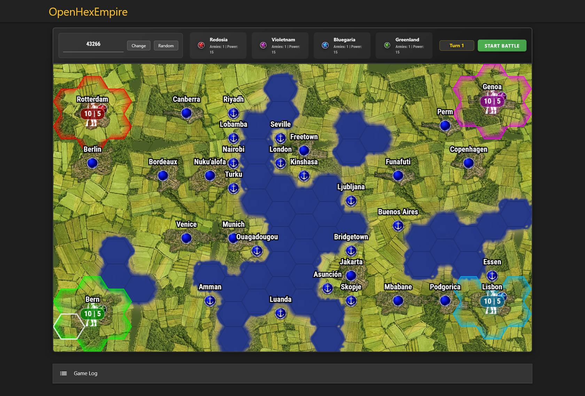
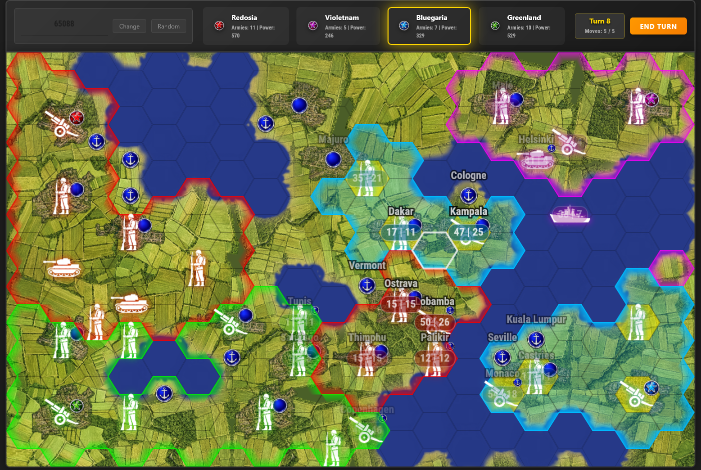

# OpenHexEmpire

A modern, open-source reimplementation of the classic Flash strategy game "Hex Empire". This project aims to faithfully recreate the original gameplay experience while enhancing it with new features, improved graphics, and support for modern web browsers.

Contributions are welcome. If you played the original Hex Empire, your feedback is particularly helpful.

<div style="display: flex; justify-content: center; margin: 20px 0;">
    
    
</div>

## ⚠️ Important Notes

- **Work in Progress**: While fully playable, this project is an active reimplementation. New features and polish will be added over time.
- **Browser Compatibility**: Optimized for modern web browsers (Chrome, Firefox, Edge).
- **Audio**: Sound effects and music are currently not implemented (planned for future updates).
- **Community**: Contributions are welcome. Feel free to open issues or submit pull requests.

## Features

- **Global domination**: Take command of one of the four empires—Redosia, Violetnam, Bluegaria, or Greenland—and conquer the map.
- **AI Opponents**: Challenge three computer-controlled factions that expand, defend their capitals, and compete for territory (Original AI logic by [Samuel Yuan](https://github.com/samuelyuan/HexEmpireAI)).
- **Modern UI**: A sleek, dark-themed interface built with Materialize CSS, featuring:
  - Real-time turn tracking
  - Capital status indicators
  - Dynamic game logs
- **Enhanced Graphics & Animations**:
  - High-resolution textures for terrain and cities
  - Fluid unit movements and attack animations powered by GSAP
  - Dynamic map rendering with smooth scaling
- **Map Generation**: Infinite replayability with procedurally generated maps and seed support (Map generation algorithm by [Samuel Yuan](https://github.com/samuelyuan/HexEmpireAI)).

## Project Structure

```
├── public/
│   ├── game/                  # Core game logic and rendering
│   │   ├── Game.js            # Main game loop and controller
│   │   ├── GameState.js       # State management
│   │   ├── MapGenerator.js    # Procedural map generation
│   │   ├── MapRender.js       # HTML5 Canvas rendering
│   │   ├── Pathfinder.js      # A* pathfinding algorithm
│   │   ├── Bot.js             # AI logic
│   │   ├── Animations.js      # GSAP animation sequences
│   │   └── Config.js          # Game configuration and constants
│   ├── css/                   # Stylesheets (Materialize, custom)
│   ├── js/                    # Client-side libraries (jQuery, Materialize)
│   └── images/                # Game assets (sprites, textures)
├── views/
│   └── index.ejs              # Main game view template
├── server.js                  # Express.js server entry point
└── package.json               # Project dependencies
```

## How It Works

The game follows the classic Hex Empire rules:
1.  **Objective**: Conquer all enemy capitals.
2.  **Movement**: You can move up to 5 armies per turn.
3.  **Morale**: Capturing territory increases morale; losing it decreases morale. Higher morale means stronger armies.
4.  **Reinforcements**: Owning cities provides more troops. Ports allow travel across water.

## Getting Started

### Prerequisites
- Node.js (v14 or higher recommended)
- npm (Node Package Manager)

### Installation

1.  Clone the repository:
    ```bash
    git clone https://github.com/ZSabakh/OpenHexEmpire.git
    cd OpenHexEmpire
    ```

2.  Install dependencies:
    ```bash
    npm install
    ```

3.  Start the server:
    ```bash
    node server.js
    ```

4.  Open your browser and navigate to:
    ```
    http://localhost:3000
    ```

## Tech Stack

-   **Backend**: Node.js, Express
-   **Frontend**: HTML5 Canvas, EJS
-   **Styling**: Materialize CSS
-   **Animations**: GSAP (GreenSock Animation Platform)

## Contributing

Contributions are welcome to help ensure the mechanics are balanced and accurate. Whether you're a developer who can write code, an artist who can improve assets, or a strategist who can help balance the gameplay, feel free to contribute!


Ways to contribute:
1.  **Code**: Fork the repo, create a feature branch, and submit a Pull Request.
2.  **Feedback**: Open an issue to report bugs or suggest new features.
3.  **Game Balance**: Help tweak the AI and game rules.

## Acknowledgments

### Original Hex Empire Flash game
-   **Original Developer**: Meta Sauce
-   **Creator / Author**: uunxx
-   **Original Publisher**: MiniJuegos
-   **Release Date**: ~March 2009

### Foundation
-   **HexEmpireAI**: This project is built upon the work of [Samuel Yuan](https://github.com/samuelyuan/), who implemented the core map generation and AI logic in [HexEmpireAI](https://github.com/samuelyuan/HexEmpireAI).

## License

This project is licensed under the MIT License.

See the [LICENSE](LICENSE) file for the full license text.
