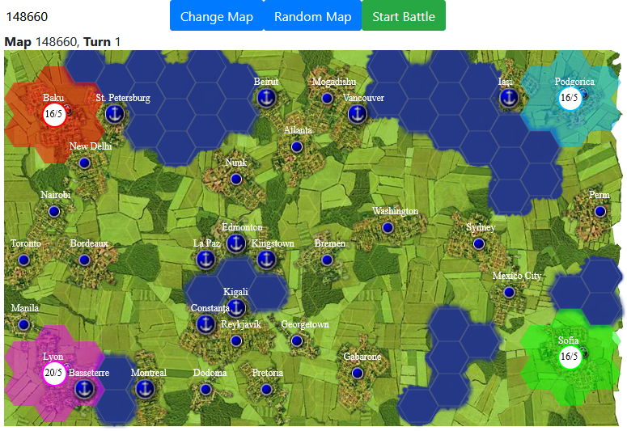

# HexEmpireAI

A strategic hex-based conquest game inspired by the flash game Hex Empire, where artificial intelligence players battle for world domination. Watch as AI-controlled armies compete to capture territories, cities, and ports in an automated turn-based strategy game.



## Features

- Turn-by-Turn Replay System: Rewatch the entire game with playback controls to see how territories changed hands
- Statistics Graphs: Track game metrics over time with interactive charts showing:
  - Cities & Ports held by each player
  - Army sizes
  - Territory control
  - Morale levels
- Organized Game Log: Browse game events by turn with collapsible sections, filtering by event type (Conquest, Capture, Moves, Annex), and search functionality
- Modern UI: Clean, compact interface optimized for viewing and screenshots
- Map Generation: Generate random maps or load specific maps by number

## Game Rules

### Setup

- 4 AI-controlled players start in each corner of the map
- Each player begins with a single army at their capital
- Players: Redosia (red), Violetnam (violet), Bluegaria (blue), Greenland (green)

### Gameplay

- Turn Order: Counterclockwise starting from Redosia (red player)
- Army Movement: Each player can move up to 5 armies per turn
- Army Representation: Displayed as `armySize/morale`
  - Morale increases when gaining territory
  - Morale decreases when losing territory

### Victory Condition

- Capture enemy capitals to eliminate opponents
- Last player standing wins

### Map Features

- Cities: 
  - Increase morale when captured
  - Provide reinforcements at the end of each turn to increase army size
- Ports: 
  - Increase morale when captured
  - Allow armies to pass through to sea routes

## Getting Started

1. Clone the project

2. Install npm dependencies
```
cd HexEmpireAI
npm install
```

3. Run nodejs
```
node server.js
```
